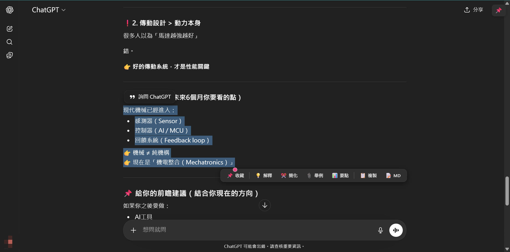
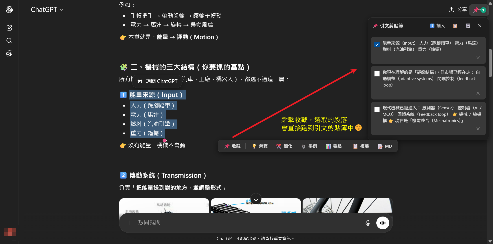

<p align="center">
  
</p>

<h1 align="center">ChatGPT Reading Assistant</h1>

<p align="center">
  <strong>ChatGPT 很會回答。但你很難重用那些答案。</strong><br>
  選取、收藏、一鍵追問 — 不用離開對話頁面。
</p>

<p align="center">
  <a href="#installation">Install</a> ·
  <a href="#features">Features</a> ·
  <a href="#usage">Usage</a> ·
  <a href="#privacy">Privacy</a> ·
  <a href="#roadmap">Roadmap</a> ·
  <a href="#contributing">Contributing</a>
</p>

<p align="center">
  
  
  
  
</p>

---

## 你一定遇過這些情況

ChatGPT 給了你一篇 2000 字的回答。你讀完了。然後呢？

- 你**滾回去找**那句關鍵的話，但已經被埋在第 37 則訊息裡
- 你想追問某一段，卻得**手動複製貼上**再打「請解釋這段」
- 你跟 AI 聊了 50 則，結束後才發現**真正有用的只有 3 句**，但你忘了是哪 3 句
- 你開了 5 個對話，每個都有一點有用的東西，但**沒有任何工具幫你整理**

你不是不會用 ChatGPT。你是缺一個**閱讀層**。

這不是資訊過多的問題。這是你沒有工具「重用資訊」的問題。

## 有 CRA vs 沒有 CRA

| 場景 | ❌ 沒有 CRA | ✅ 有 CRA |
|------|------------|----------|
| 想追問某一段 | 複製 → 貼上 → 打「請解釋」→ 送出 | **選取 → 點一下「解釋」→ 完成** |
| 收集重點 | 開記事本 → 手動複製 → 來回切換 | **選取 → 📌 收藏 → 自動累積** |
| 引用多段內容追問 | 一段一段複製，手動排版 | **勾選想要的 → 一鍵插入輸入框** |
| 找回之前看到的那句話 | 無限滾動，靠記憶 | **打開引文面板，全部都在** |
| 複製程式碼區塊 | 格式跑掉，要手動修 | **📝 MD 一鍵複製，格式完整保留** |

## 它能幫你做什麼

### 📌 選完就收藏，讀完不會忘
看到重要的句子？選取它，點一下收藏，**立即保存**。繼續讀。所有收藏的片段會自動累積在側邊面板，不怕忘、不怕丟。

<!--  -->

### 💡 一鍵追問，不用打字
選取一段看不懂的內容，點「解釋」— 系統自動把提示詞填進輸入框。你只需要按 Enter。同樣適用於「簡化」「舉例」「整理要點」。

### 📋 多段引用，一次搞定
收藏了 5 段內容？勾選你要的，點「插入」— 全部引文自動整理好，放進輸入框，附帶上下文提示。不用一段一段複製。

<!--  -->

### 🔒 你的資料只在你的電腦上
零網路請求。零數據收集。零雲端同步。沒有任何第三方追蹤。沒有背景同步。你看到的就是全部。

原始碼 2,300 行，零依賴，你可以逐行審查。

### ⚙️ 即開即用的設定
模組隨時開關 — **即時生效**，不用重新整理頁面。引文匯出為 JSON 或 Markdown。內建診斷工具。

## Demo

<!-- TODO: Replace with actual GIF -->
<!--  -->

> **Coming soon:** A 30-second demo GIF showing the full workflow.

## 兩分鐘安裝，馬上開始用

> 不需要帳號。不需要 API key。不需要付費。

### From Source (Developer Mode)

**所需時間：~2 分鐘**

1. **Download** this repository
   ```bash
   git clone https://github.com/user/chatgpt-reading-assistant.git
   ```
   Or click **Code → Download ZIP** and unzip.

2. **Open Chrome Extensions**
   - Navigate to `chrome://extensions/`
   - Enable **Developer mode** (toggle in the top-right corner)

3. **Load the extension**
   - Click **Load unpacked**
   - Select the project folder (the one containing `manifest.json`)

4. **Open ChatGPT**
   - Go to [chatgpt.com](https://chatgpt.com)
   - Select any text in a conversation — the toolbar appears!

<!-- ### From Chrome Web Store -->
<!-- > **Coming soon** — CRA is currently in review for the Chrome Web Store. -->

## Usage

### Scenario 1: Collecting Key Points from a Long Conversation
1. Read through a long ChatGPT response
2. Select important sentences → click 📌 **Collect**
3. Repeat for multiple sections
4. Open the citation panel → review all collected snippets
5. Click **Insert** → all quotes are inserted as a reference prompt

### Scenario 2: Quick Follow-Up Questions
1. Select a confusing paragraph
2. Click 💡 **Explain** → the prompt auto-fills in the input box
3. Hit Enter — ChatGPT explains that specific section

### Scenario 3: Export Research Notes
1. Collect quotes throughout a research session
2. Open the extension popup → click **📝 MD Export**
3. Get a clean Markdown file with all your collected quotes

## Permissions

CRA requests the **minimum permissions** required:

| Permission | Why |
|-----------|-----|
| `storage` | Save your quotes and settings **locally on your device** |
| Host access: `chatgpt.com`, `chat.openai.com` | Inject the toolbar and citation panel into ChatGPT pages |

**That's it.** No `tabs`, no `webRequest`, no `identity`, no background network access.

## Privacy

**CRA 不收集任何資料。句號。**

- 零分析追蹤
- 零外部 API 呼叫
- 零資料離開你的瀏覽器
- 零雲端同步
- 所有引文存在 `chrome.storage.local`（僅在你的裝置上）
- 完整隱私政策：[PRIVACY.md](PRIVACY.md)

> **為什麼這很重要：** 很多 Chrome 擴充功能會要求廣泛權限並把資料送到外部伺服器。CRA 的設計可供審計 — 整個程式碼庫只有 ~2,300 行 vanilla JavaScript，零依賴。沒有任何第三方追蹤。沒有背景同步。你看到的就是全部。

## Tech Stack

| Component | Choice | Why |
|----------|--------|-----|
| Extension API | Manifest V3 | Latest Chrome standard |
| Language | Vanilla JavaScript | Zero dependencies, fully auditable |
| Module pattern | IIFE | No bundler needed, fast load |
| Storage | `chrome.storage.local` | Private, persistent, no server |
| Styling | CSS Variables | Auto dark/light theme matching |

## Architecture

```
chatgpt-reading-assistant/
├── manifest.json               # Extension manifest (MV3)
├── utils/
│   ├── storage.js              # CRAStorage — chrome.storage abstraction
│   ├── event-bus.js            # CRAEventBus — pub/sub with type checking
│   ├── events.js               # CRAEvents — centralized event constants
│   ├── ui-helpers.js           # Toast notifications, HTML escaping
│   └── markdown.js             # HTML-to-Markdown conversion
├── content/
│   ├── core/
│   │   ├── dom.js              # CRADom — DOM selectors (multi-fallback)
│   │   ├── registry.js         # CRAModuleRegistry — lifecycle + DI
│   │   ├── runtime-handler.js  # chrome.runtime message routing
│   │   ├── spa-observer.js     # SPA navigation detection
│   │   └── bootstrap.js        # Main orchestrator (pure orchestration)
│   └── modules/
│       ├── message-scanner.js  # MutationObserver message detection
│       ├── input-integration.js# ProseMirror input box integration
│       ├── selection-tracker.js# Text selection event tracking
│       ├── selection-toolbar.js# Floating toolbar UI
│       └── citation-clipboard.js# Citation panel UI + storage
├── content.css                 # Theme-aware styles (dark/light)
├── background.js               # Service worker (message relay)
└── popup.html/css/js           # Extension settings popup
```

## FAQ

<details>
<summary><strong>Does CRA work with GPT-4, GPT-4o, o1, etc.?</strong></summary>
Yes. CRA works with any model on chatgpt.com — it interacts with the UI, not the API.
</details>

<details>
<summary><strong>Does CRA send my conversations to any server?</strong></summary>
No. CRA has zero network calls. Everything stays in your browser. You can verify this by inspecting the source code — there are no <code>fetch()</code> or <code>XMLHttpRequest</code> calls.
</details>

<details>
<summary><strong>Will CRA break when ChatGPT updates?</strong></summary>
CRA uses multi-fallback DOM selectors to handle ChatGPT UI changes. If a selector breaks, it automatically tries alternatives. Major redesigns may require an update.
</details>

<details>
<summary><strong>Does it work on mobile?</strong></summary>
No. CRA is a Chrome desktop extension. Mobile Chrome does not support extensions.
</details>

<details>
<summary><strong>Does it work on Edge / Brave / Arc?</strong></summary>
Yes. Any Chromium-based browser that supports Manifest V3 extensions.
</details>

<details>
<summary><strong>Can I use it with ChatGPT Teams / Enterprise?</strong></summary>
Yes, as long as you access ChatGPT via chatgpt.com in Chrome.
</details>

## Roadmap

### v0.2 — Condense Engine (Next)
- AI-powered conversation summarization
- Collapsible message sections
- TL;DR generation

### v0.3 — Side Navigation
- Table of contents for long conversations
- Jump-to-message navigation
- Topic detection

### v0.4 — Page Search
- Full-text search within conversations
- Regex support
- Search history

### Future
- Cross-conversation quote management
- Quote tagging and categorization
- Keyboard shortcuts
- Chrome Web Store publication

## Contributing

Contributions are welcome! See [CONTRIBUTING.md](CONTRIBUTING.md) for setup instructions, code standards, and PR workflow.

Quick start:
```bash
git clone https://github.com/user/chatgpt-reading-assistant.git
# Load unpacked in chrome://extensions/
# Make changes → reload extension → test on chatgpt.com
```

## License

[MIT](LICENSE) — Use it freely, commercially or personally.

---

**如果你每天都在用 ChatGPT，卻還在手動複製貼上，你其實在浪費時間。**

⭐ 如果覺得有用，請給個 Star — 這是開源專案最重要的燃料。

<p align="center">
  <sub>Built for people who read ChatGPT conversations seriously.</sub>
</p>
